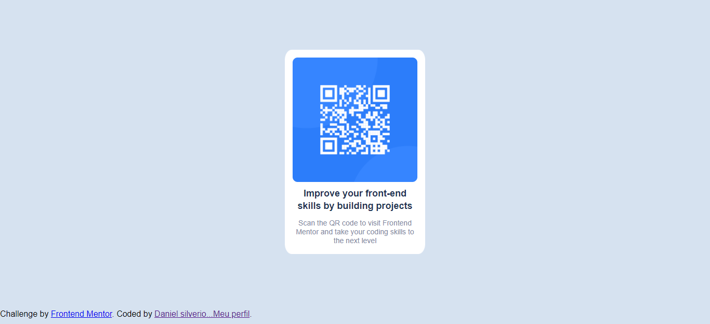

# componente-de-c-digo-QR
## componente de código QR Frontend Mentor

Primeiro desafio feito concluido.
* Desafio consistia, em criar uma pagina com um cartão Qr Code.
* Para concluir deveria ser feito deploy em uma pagina autorizada pelo Frontend Mentor.
  
 ### Abaixo vc vera uma imagem de como deveria ficar a pagina ...

 

 #### Abaixo veja Como ficou...

 

 ## OBSERVAÇÃO:
 Fiz um pouco maior de proposito achei de melhor vizualização...

 ## tecnologias usadas:
 * HTML5
 * CSS3
  
  LINK_SITE: